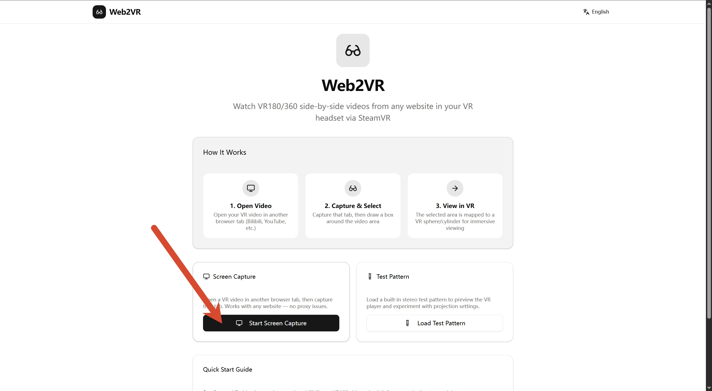
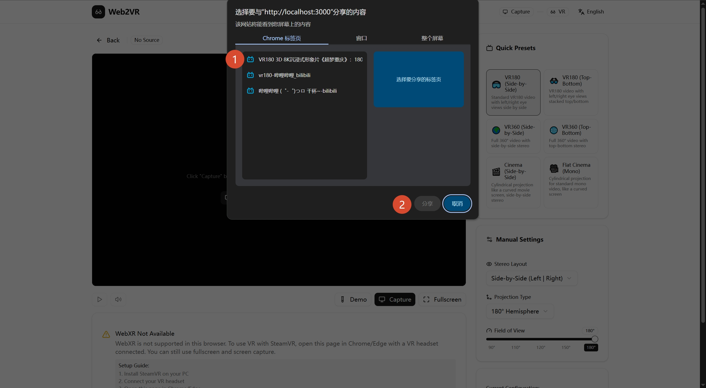
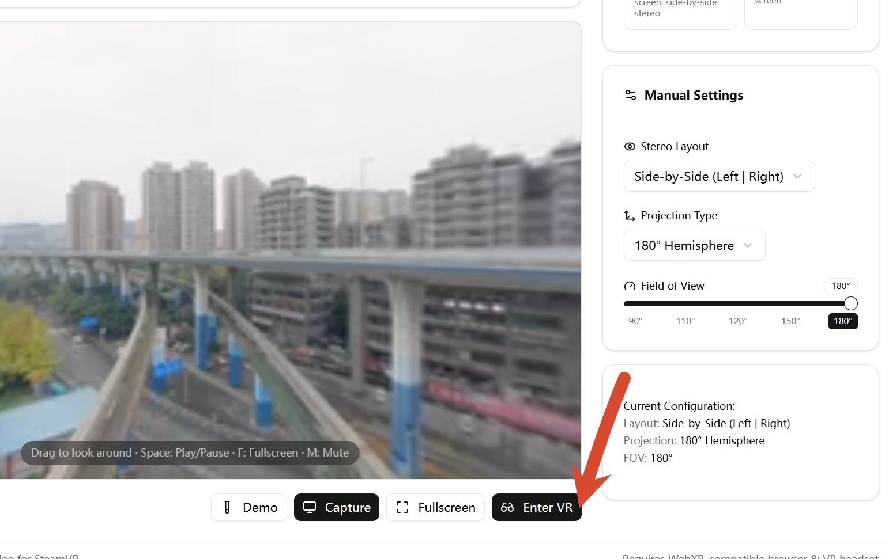

# Web2VR

**Watch any website's side-by-side video in your VR headset — no download.**

Web2VR captures a browser tab using the Chrome Screen Capture API (`getDisplayMedia`), maps it onto a VR sphere/hemisphere/cylinder with proper stereo UV separation, and streams it to your VR headset through WebXR.

---

## ✨ Features

- **Screen Capture** — Capture any browser tab playing VR video (Bilibili, YouTube, etc.) via `getDisplayMedia`. No server-side proxy needed; works with any website.
- **VR Playback** — Immersive VR viewing through WebXR (`immersive-vr` session). Supports SteamVR-compatible headsets.
- **Multiple Projections** — 360° Sphere, 180° Hemisphere, and Cylinder (cinema) projections.
- **Stereo Layouts** — Side-by-Side (SBS), Top-Bottom (TB), and Mono modes.
- **Region Cropping** — Draw a box around the video area in the preview to isolate just the content you want.
- **Cross-platform Packaging** — One-command packaging for Linux, Windows, and macOS with bundled Node.js runtime.



## 🚀 Quick Start

### Prerequisites

- **Node.js** ≥ 18 / **Bun** ≥ 1.0
- **Chrome** or **Edge** browser with WebXR support
- **VR headset** + **SteamVR** (for VR mode)

### Development

```bash
# Install dependencies
bun install

# Start dev server
bun run dev
```

Open `http://localhost:3000` in Chrome/Edge with your VR headset connected.

### Production Build

```bash
bun run build
bun run start
```

### Package for Distribution

**Node.js packager** (cross-platform):

```bash
# Current platform
bun run package

# Specific platform
bun run package:linux    # Linux x64
bun run package:win      # Windows x64
bun run package:mac      # macOS ARM64
bun run package:all      # All platforms
```

**PowerShell packager** (Windows native, also cross-platform with PowerShell 7+):

```powershell
# Current platform
.\scripts\package.ps1

# Specific platform
.\scripts\package.ps1 -Platform win-x64
.\scripts\package.ps1 -Platform linux-x64
.\scripts\package.ps1 -Platform darwin-arm64
.\scripts\package.ps1 -Platform all
```

Or via bun:

```bash
bun run package:ps1          # Current platform
bun run package:ps1:win      # Windows x64
bun run package:ps1:linux    # Linux x64
bun run package:ps1:mac      # macOS ARM64
bun run package:ps1:all      # All platforms
```

Output archives are placed in the `dist/` directory, each containing a bundled Node.js runtime and a launcher script — no installation required on the target machine.

## 🎮 How to Use

1. **Open a VR video** in another browser tab (e.g. a Youtube VR180 video, to make the next steps easier, **do not** play in full screen or theater mode yet).
2. **Click "Start Screen Capture"** in Web2VR, then select the tab with the video.

3. **[Options]Crop the video area**
 > Use "Select Region" to draw a box around the VR video content in the preview.
 > ![[Options]Click here to select reigon](./images/4selectregion.jpg)
 > Select region
 > ![[Options]Select reigon](./images/4clip.jpg)
4. **Choose a VR preset** — Select the appropriate preset (e.g. VR180 SBS, VR360 TB) from the settings panel.
5. **Set the video to fullscreen** - Now you can set the video you just opened to full screen. This makes it convenient to operate videos in full screen, fitting them perfectly within the tab.
6. **Enter VR** — Click "Enter VR" to start immersive viewing in your headset.


## 🛠️ Tech Stack

| Layer | Technology |
|-------|-----------|
| Framework | [Next.js 16](https://nextjs.org/) (App Router) |
| Language | TypeScript 5 |
| 3D / VR | [Three.js](https://threejs.org/) + WebXR API |
| State | [Zustand](https://zustand.docs.pmnd.rs/) |
| UI | [shadcn/ui](https://ui.shadcn.com/) + [Tailwind CSS 4](https://tailwindcss.com/) |
| Icons | [Lucide React](https://lucide.dev/) |
| Runtime | [Bun](https://bun.sh/) |

## 📁 Project Structure

```
src/
├── app/
│   ├── layout.tsx            # Root layout
│   ├── page.tsx              # Main page (landing + player)
│   └── globals.css           # Global styles
├── components/
│   ├── ui/                   # shadcn/ui components
│   └── vr/
│       ├── landing-page.tsx   # Landing page with capture/test buttons
│       ├── vr-player.tsx      # Core VR player (Three.js + WebXR)
│       └── vr-settings.tsx    # Settings panel (presets, projection, FOV)
├── lib/
│   ├── i18n/
│   │   ├── translations.ts   # 160+ translation keys (EN/ZH)
│   │   └── useTranslation.tsx # Translation hooks
│   ├── vr/
│   │   └── vr-presets.ts     # VR preset definitions
│   └── utils.ts              # Utility functions
└── store/
    ├── language-store.ts     # Zustand language state
    └── vr-store.ts           # Zustand VR state
```

## 🎯 VR Projection Details

| Projection | Geometry | Default FOV | Use Case |
|-----------|----------|-------------|----------|
| 180° Hemisphere | Half-sphere facing viewer | 180° | VR180 videos |
| 360° Sphere | Full sphere | 180° | VR360 videos |
| Cylinder | Curved screen | 90–120° | Cinema / flat video |

### Stereo Layouts

- **SBS (Side-by-Side)** — Left eye uses the left half, right eye uses the right half of the captured frame. Most common for VR180 content.
- **TB (Top-Bottom)** — Left eye uses the top half, right eye uses the bottom half.
- **Mono** — Single view mapped to the entire projection surface.

### UV Modification

For stereo content, Web2VR modifies the UV coordinates of the projection geometry so that each eye only sees its corresponding half of the captured frame. The left eye mesh is assigned to XR `layer 1` and the right eye mesh to `layer 2`, leveraging WebXR's built-in layer-based stereoscopic rendering.

## 🌐 Browser Compatibility

| Feature | Chrome | Edge | Firefox | Safari |
|---------|--------|------|---------|--------|
| Screen Capture (`getDisplayMedia`) | ✅ | ✅ | ⚠️ Limited | ❌ |
| WebXR (`immersive-vr`) | ✅ | ✅ | ❌ | ❌ |

> **Note:** VR mode requires a Chromium-based browser with WebXR support and a VR headset connected via SteamVR.

## 📄 License

[MIT](./LICENSE)
